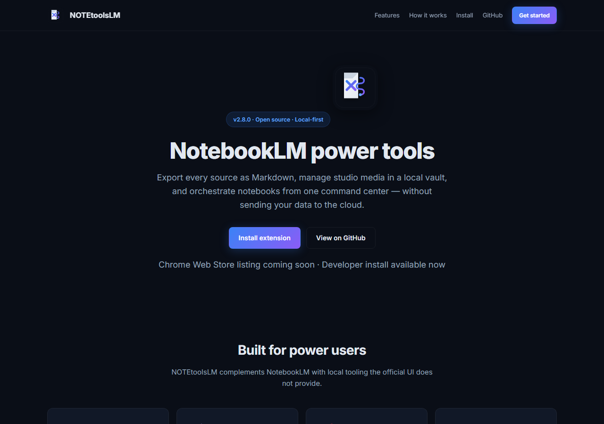
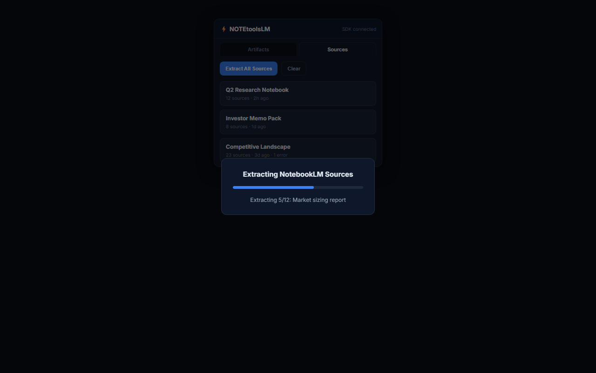
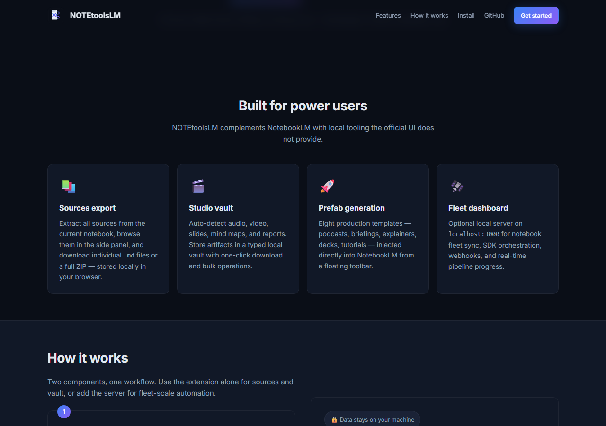
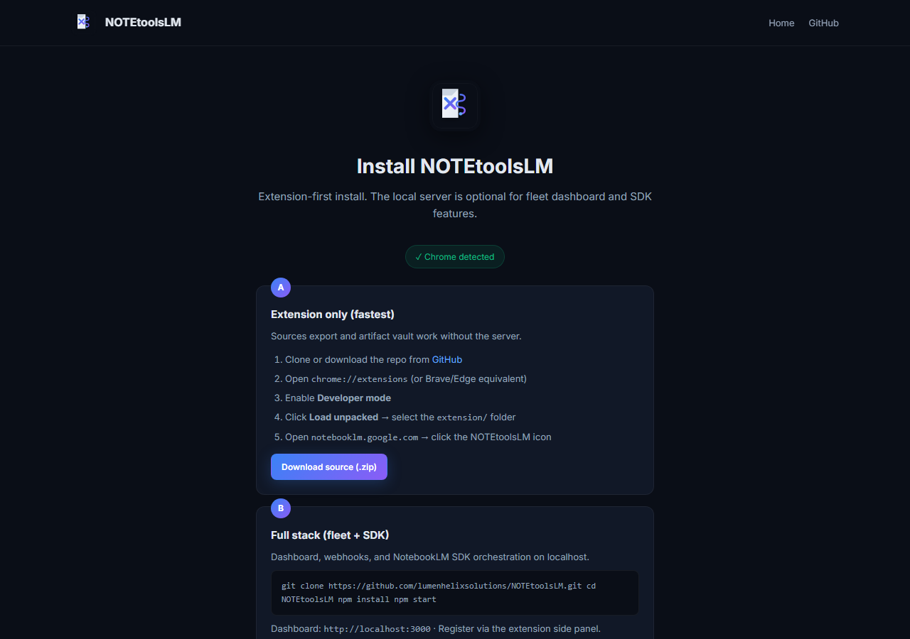

<p align="center">
  
</p>

<h1 align="center">NOTEtoolsLM</h1>
<p align="center">
  <strong>NotebookLM power tools — sources, studio media, and local vault.</strong><br>
  Open-source command center for Google NotebookLM power users.
</p>

<p align="center">
  <a href="https://lumenhelixsolutions.github.io/NOTEtoolsLM/"></a>
  <a href="#"></a>
  <a href="#"></a>
  <a href="#"></a>
  <a href="#"></a>
  <a href="#"></a>
</p>

<p align="center">
  <a href="https://lumenhelixsolutions.github.io/NOTEtoolsLM/install.html"><strong>Install guide</strong></a>
  &nbsp;·&nbsp;
  <a href="https://github.com/lumenhelixsolutions/NOTEtoolsLM">GitHub</a>
  &nbsp;·&nbsp;
  <a href="docs/ROADMAP.md">Roadmap</a>
</p>

---

## What is NOTEtoolsLM?

NOTEtoolsLM is a **local-first productivity suite** for [Google NotebookLM](https://notebooklm.google.com). It adds what the official UI lacks: bulk source export, studio media vault, prefab generation, and an optional fleet dashboard — without sending your notebook data to third-party servers.

| Component | Tech | Role |
|-----------|------|------|
| **Browser extension** | Chrome MV3 | Side panel on NotebookLM: sources export, artifact vault, prefabs |
| **Fleet orchestrator** | Node.js + Express + WebSocket | Optional `localhost:3000` dashboard, SDK, webhooks |

**Launch site:** [lumenhelixsolutions.github.io/NOTEtoolsLM](https://lumenhelixsolutions.github.io/NOTEtoolsLM/)

---

## Features

### Sources export (new in v2.8)
Inspired by community tooling for NotebookLM source backups — reimplemented as an integrated, MIT-licensed feature.

- **Extract All Sources** from the current notebook (DOM-based, runs in-browser)
- **Local export library** — browse past extractions in the side panel
- **Per-source Markdown** download with title, URL, and body
- **Bulk ZIP** export with optional image files
- Respects NotebookLM source checkbox selection (excluded sources skipped)
- **100% local** — no server required for extraction or storage

### Studio media vault
- Auto-detect audio, video, slides, mind maps, and reports
- Side panel grid with filter chips and inspector (CDI score)
- One-click store to `~/Downloads/vault-storage/`
- Badge count for pending artifacts

### Prefab generation
Eight templates injected via floating toolbar or side panel:

| Prefab | Type |
|--------|------|
| Deep-Dive Podcast | audio |
| Executive Briefing | report |
| Explainer Video | video |
| Investor Slide Deck | slide_deck |
| Knowledge Mind Map | mind_map |
| Critique & Debate | audio |
| Tutorial Walkthrough | audio |
| Competitive Analysis | report |

### Fleet dashboard (optional server)
- Notebook fleet sync via NotebookLM SDK
- Production pipeline with WebSocket progress
- Bulk download, store, delete across artifacts
- Webhook callbacks with HMAC validation
- JWT auth, SQLite users, brute-force protection

---

## Quick start

### Extension only (sources + vault)

Best if you only need sources export and artifact management.

1. Clone this repo
2. Open `chrome://extensions` → enable **Developer mode**
3. **Load unpacked** → select the `extension/` folder
4. Open [notebooklm.google.com](https://notebooklm.google.com) → click the NOTEtoolsLM icon
5. Use the **Sources** tab → **Extract All Sources**

Detailed steps: [install guide](https://lumenhelixsolutions.github.io/NOTEtoolsLM/install.html)

### Full stack (fleet + SDK)

```bash
git clone https://github.com/lumenhelixsolutions/NOTEtoolsLM.git
cd NOTEtoolsLM
npm install
npm start
# Dashboard → http://localhost:3000
```

Register an account via the extension side panel, then optionally:

```bash
npx notebooklm-sdk login
```

Copy `.env.example` to `.env` and set `JWT_SECRET` for persistent auth across restarts.

---

## Screenshots

| Launch site | Sources export | Features | Install |
|-------------|------------------|----------|---------|
|  |  |  |  |

---

## Architecture

```
┌──────────────────┐     REST / WebSocket      ┌─────────────────────┐
│  Chrome Extension │ ◄──────────────────────► │ Fleet Orchestrator  │
│  Artifacts        │                          │ (Node.js, optional) │
│  Sources export   │                          └──────────┬──────────┘
└────────┬─────────┘                                     │
         │ content script                                │ SDK / Playwright
         ▼                                               ▼
┌──────────────────┐                          ┌─────────────────────┐
│ notebooklm.google │                          │  Local vault + API   │
│     .com        │                          └─────────────────────┘
└──────────────────┘
```

See [docs/ARCHITECTURE.md](docs/ARCHITECTURE.md) for the technical deep-dive.

---

## API highlights

| Endpoint | Description |
|----------|-------------|
| `GET /api/notebooks/:id/sources` | List sources via SDK |
| `POST /api/sources/export-zip` | Build ZIP from source payload |
| `POST /api/discovery/sync` | Fleet artifact discovery |
| `POST /api/generate` | Prefab → SDK artifact job |

Full API runs on the local server only. Sources extraction does not require these routes.

---

## Development

```bash
npm install
npm run dev          # server with --watch
npm test             # smoke tests
npm run build        # package extension zip
node scripts/generate-icons.js   # refresh icons from logo SVG
```

See [AGENTS.md](AGENTS.md) and [docs/CONTRIBUTING.md](docs/CONTRIBUTING.md).

---

## Roadmap

| Milestone | Theme | Target |
|-----------|-------|--------|
| M1 | SDK foundation repair | v2.9.0 |
| M2 | Sources command center | v3.0.0 |
| M3 | Studio media factory | v3.1.0 |

See [docs/ROADMAP.md](docs/ROADMAP.md) and [docs/plans/2026-06-12-notetoolslm-api-power-5x5.md](docs/plans/2026-06-12-notetoolslm-api-power-5x5.md).

---

## Security & privacy

- **Local-first** — exports and vault data stay on your machine
- **User-triggered** — no auto-scrape or auto-send
- **No telemetry** — the project does not phone home
- **Not affiliated with Google**

See [docs/SECURITY.md](docs/SECURITY.md) and [docs/privacy-policy.html](docs/privacy-policy.html).

---

## Contributing

Contributions welcome. Run `npm run ci` before opening a PR.

---

## License

MIT © NOTEtoolsLM Collective. See [LICENSE](LICENSE).

---

<p align="center">
  
  <br>
  <sub>Built with care by the community · <a href="https://lumenhelixsolutions.github.io/NOTEtoolsLM/">Launch site</a></sub>
</p>