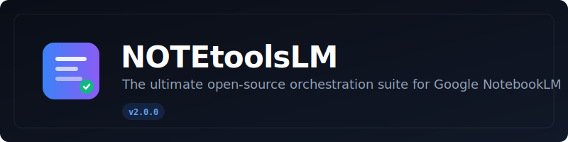

<p align="center">
  
</p>

<h1 align="center">NOTEtoolsLM v2</h1>
<p align="center">
  <strong>The ultimate open-source orchestration suite for Google NotebookLM.</strong><br>
  Fleet dashboard. Browser extension. Local vault. One unified command center.
</p>

<p align="center">
  <a href="#"></a>
  <a href="#"></a>
  <a href="#"></a>
  <a href="#"></a>
  <a href="#"></a>
</p>

---

## ✨ What is NOTEtoolsLM?

NOTEtoolsLM is a **dual-architecture productivity suite** for power users of [Google NotebookLM](https://notebooklm.google.com):

| Component | Tech | What it does |
|-----------|------|--------------|
| **Fleet Orchestrator** | Node.js + Express + WebSocket | Local dashboard & API server on `localhost:3000` |
| **Browser Extension** | Chrome Extension MV3 | Side panel + content-script tooling directly on `notebooklm.google.com` |

Instead of hunting through notebooks one-by-one, NOTEtoolsLM gives you a **unified fleet view**: auto-detect artifacts, batch-manage them, generate from prefabs, and store everything in a local vault.

---

## 🚀 Features

### Fleet Dashboard
- 📊 **Notebook Fleet Sync** — list and manage all your notebooks via SDK
- 🏭 **Production Pipeline** — Kanban board (Queued → Running → Processing → Completed → Failed)
- 🔍 **Artifact Discovery** — dual strategy: SDK API scan + Playwright UI scraping
- 🗂️ **Local Vault** — organized storage by type (`~/vault-storage/{audio,video,slides,maps,reports}/`)
- 📦 **Bulk Operations** — select, download, store, delete across many artifacts at once
- 🔎 **Inspector Panel** — metadata, prompt preview, and synthetic CDI (Citation Density Index)
- 🔄 **Real-time** — WebSocket live updates with HTTP polling fallback

### Browser Extension
- 🧩 **Side Panel** — persistent vault grid, inspector, settings, onboarding gate
- 🎯 **Floating Toolbar** — quick-launch prefab generation injected on NotebookLM
- 📥 **One-click Store** — download and organize artifacts without leaving the page
- 🔔 **Badge Counts** — see how many artifacts are waiting at a glance

### Content Generation (Prefabs)
8 production-ready templates:

| Prefab | Type | Description |
|--------|------|-------------|
| 🎙️ Deep-Dive Podcast | audio | 15-20 min conversational exploration |
| 📊 Executive Briefing | report | One-page summary with actions |
| 🎬 Explainer Video | video | Script with scenes, narration, timing |
| 📑 Investor Slide Deck | slides | 10-slide pitch with speaker notes |
| 🧠 Knowledge Mind Map | map | Hierarchical concept branches |
| ⚖️ Critique & Debate | audio | Balanced two-perspective debate |
| 🎓 Tutorial Walkthrough | audio | Step-by-step instructional |
| 🔍 Competitive Analysis | report | Market breakdown with matrix |

---

## 📦 Installation

### Prerequisites
- [Node.js](https://nodejs.org/) >= 18.0.0
- Google Chrome, Brave, or Edge (Chromium-based)

### 1. Clone & Install
```bash
git clone https://github.com/notetoolslm/notetoolslm.git
cd notetoolslm
npm install
```

### 2. Start the Fleet Orchestrator
```bash
npm start
# Dashboard opens at http://localhost:3000
```

### 3. Load the Extension (Developer Mode)
1. Open Chrome/Brave and go to `chrome://extensions/`
2. Enable **Developer Mode** (toggle top-right)
3. Click **Load unpacked**
4. Select the `extension/` folder
5. Click the NOTEtoolsLM icon in the toolbar to open the side panel

### 4. Authenticate (Optional but Recommended)
```bash
npx notebooklm-sdk login
# Or click "Sync Auth" in the dashboard
```

---

## 🖥️ Screenshots

> *(Placeholder — add 1280×800 screenshots here before launch)*

| Dashboard | Pipeline Kanban | Extension Side Panel |
|-----------|-----------------|----------------------|
| `docs/assets/screenshot-dashboard.png` | `docs/assets/screenshot-pipeline.png` | `docs/assets/screenshot-extension.png` |

---

## 🏗️ Architecture

```
┌─────────────────┐      WebSocket/REST       ┌──────────────────┐
│   Chrome Ext    │ ◄──────────────────────► │  Fleet Orchestrator │
│  (sidepanel)    │                           │   (Node.js/Express) │
└────────┬────────┘                           └─────────┬──────────┘
         │                                              │
         │ content_script.js                            │ Playwright
         ▼                                              ▼
┌─────────────────┐                           ┌──────────────────┐
│ notebooklm.google│                           │  notebooklm SDK  │
│   .com          │                           │   + local vault  │
└─────────────────┘                           └──────────────────┘
```

See [docs/ARCHITECTURE.md](docs/ARCHITECTURE.md) for the full technical deep-dive.

---

## 🛣️ Roadmap

- [x] v2.0.0-beta — Fleet dashboard, extension, vault, 8 prefabs
- [ ] v2.1.0 — Real NotebookLM SDK artifact generation (replace simulation)
- [ ] v2.2.0 — License enforcement + Pro/Free tier gating
- [ ] v2.3.0 — Chrome Web Store public listing
- [ ] v2.4.0 — Multi-language i18n expansion
- [ ] v2.5.0 — Collaborative team workspaces

See [docs/ROADMAP.md](docs/ROADMAP.md) for detailed milestones.

---

## 🤝 Contributing

We welcome contributions! Please read [docs/CONTRIBUTING.md](docs/CONTRIBUTING.md) for guidelines on:
- Setting up your dev environment
- Code style and conventions
- Testing requirements
- Pull request process

### Quick Dev Setup
```bash
npm install
npm run dev      # auto-reload server on file changes
npm test         # run smoke tests
npm run build    # package extension zip
```

---

## 🔒 Security

See [docs/SECURITY.md](docs/SECURITY.md) for our security policy and vulnerability reporting process.

Key principles:
- **Local-first** — your data stays on your machine
- **No telemetry** — we don't phone home
- **Explicit consent** — all actions are user-triggered

---

## 📜 License

MIT © NOTEtoolsLM Collective. See [LICENSE](LICENSE) for details.

---

<p align="center">
  <sub>Built with 💜 by the community. Not affiliated with Google.</sub>
</p>
