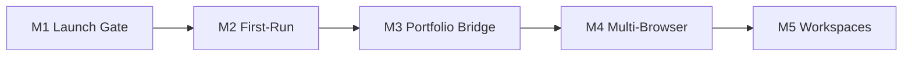
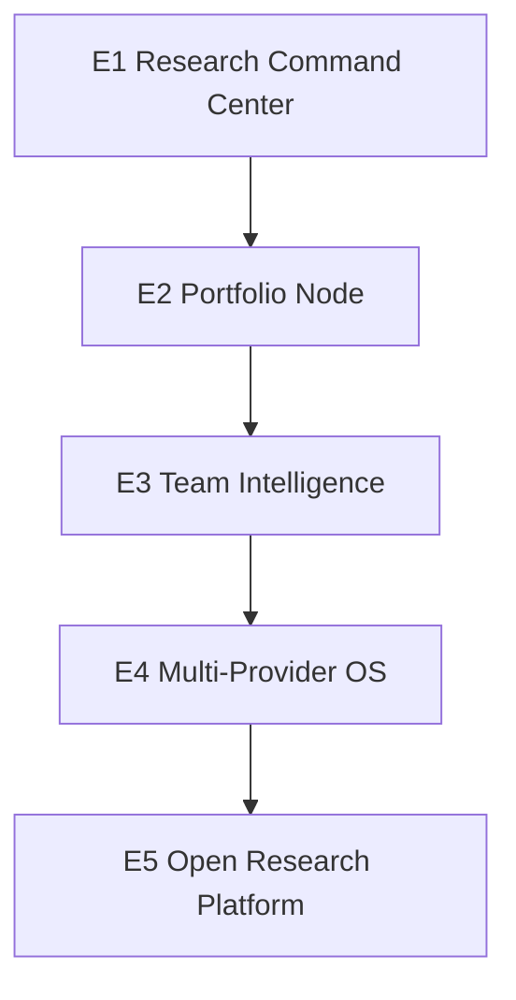

# NOTEtoolsLM v2 — 5 Milestones + 5 Evolution

**Date:** 2026-06-12  
**Baseline:** Build-first M1–M10 complete (`docs/plans/2026-06-10-notetoolslm-10-milestones.md`) — v2.8.0  
**Tests:** 55 pass / 18 skipped (`api.workspace`, `api.rbac` deferred)  
**Principles:** Local-first · user-triggered · SDK-first with simulation fallback

---

## Where we are

| Layer | Status |
|-------|--------|
| Fleet dashboard + WebSocket | ✅ |
| Chrome MV3 extension (side panel, scrape, prefabs) | ✅ |
| JWT auth + vault + ZIP/JSON export | ✅ |
| SDK job queue + CDI inspector | ✅ |
| Portfolio export API (`cineforge` / `lookbook`) | ✅ API only |
| Chrome Web Store public launch | ⬜ assets partial, not submitted |
| Team workspaces API | 🟡 server routes exist; tests skipped |
| Firefox build (`extension-firefox/`) | 🟡 packaged, not listed |

This plan replaces the open-ended ROADMAP backlog with **5 execution milestones** (ship next) and **5 evolution stages** (strategic arc).

---

## Part A — 5 Milestones (execution)

Target window: **v2.9.0 → v3.2.0** (~6–10 weeks)



### M1 — Public Launch Gate · v2.9.0

**Outcome:** A stranger can install from Chrome Web Store and reach a working fleet view in &lt;10 minutes.

| Work item | Detail |
|-----------|--------|
| Store assets | Capture 5× 1280×800 PNGs, promo tiles, demo GIF (&lt;5 MB) per `docs/chrome-web-store/STORE_ASSETS.md` |
| CWS submit | `npm run package:extension` → upload `dist/extension.zip`; privacy policy linked |
| CI gate | `npm run ci` required on `main`; fix any skipped flaky integration tests |
| Install doc | `install.html` + README CWS badge points at live listing |

**Done when**
- [ ] Extension is **Public** on Chrome Web Store
- [ ] `STORE_RELEASE_CHECKLIST.md` manual QA section signed off
- [ ] Fresh VM install: register → side panel → discovery sync succeeds (SDK or simulation)

**Verify:** `docs/chrome-web-store/STORE_RELEASE_CHECKLIST.md`

---

### M2 — First-Run Reliability · v2.9.1

**Outcome:** First launch never ends in a silent broken state — users see what failed and how to fix it.

| Work item | Detail |
|-----------|--------|
| Preflight module | `lib/preflight.js` — server ping, JWT expiry, SDK status, vault writable |
| Extension gate | Extend `extension/sidepanel/onboard.js` — Step 0 system check before vault grid |
| Dashboard gate | `public/index.html` banner when preflight fails |
| Persist state | `%LOCALAPPDATA%/NOTEtoolsLM/preflight.json` (or `DATA_DIR`) with `can_operate` flag |
| Remediation CTAs | Start server · Re-login · Enable simulation · Open setup docs |

**Done when**
- [ ] `tests/preflight.test.js` covers pass/fail matrix
- [ ] Extension blocks prefab generate until `can_operate === true` (or explicit override)
- [ ] Logs written to `DATA_DIR/logs/preflight.log`

**Verify:** `npm test` + manual cold-start on machine without server running

---

### M3 — Portfolio Pipeline Bridge · v3.0.0

**Outcome:** Research artifacts flow one-click into lookBOOK and cineforge — NOTEtoolsLM becomes a portfolio node.

| Work item | Detail |
|-----------|--------|
| Export UI | Dashboard + extension: **Send to lookBOOK** / **Send to cineforge** on selected artifacts |
| Push endpoint | `POST /api/vault/export/push` — `{ target, items, destUrl? }` using `lib/portfolio-export.js` |
| File drop | Default: write `dist/portfolio-push/<target>/` manifests for local ingest |
| Optional HTTP | `--push` to cineforge `POST /projects/{id}/ingest/lookbook` when server URL configured |
| Docs | Update `docs/PIPELINE_INTEGRATIONS.md` + `README.md` bridge section |

**Done when**
- [ ] `tests/portfolio-export.test.js` extended for push path
- [ ] lookBOOK `export-cineforge` / cineforge ingest accepts NOTEtoolsLM manifest shape
- [ ] End-to-end: NotebookLM artifact → NOTEtoolsLM vault → lookBOOK source manifest on disk

**Verify:** `npm test` + manual push of one report prefab into lookBOOK fixture project

---

### M4 — Multi-Surface Distribution · v3.1.0

**Outcome:** Same release train ships Chrome, Firefox, and Edge builds.

| Work item | Detail |
|-----------|--------|
| Firefox | Submit `dist/extension-firefox.zip` to AMO (`scripts/build-firefox.js` already exists) |
| Edge | Repackage MV3 zip for Partner Center |
| Release script | `npm run release:all` — ci → package chrome → build firefox → checksum manifest |
| Version lock | Single `package.json` version drives all manifests |

**Done when**
- [ ] Firefox add-on listed (unlisted minimum, public preferred)
- [ ] Edge listing live or in review
- [ ] `CHANGELOG.md` entry per store

**Verify:** Load each unpacked build; prefab job + vault store on `notebooklm.google.com`

---

### M5 — Team Workspaces · v3.2.0

**Outcome:** Small teams share notebook fleets and vault paths without giving up local-first defaults.

| Work item | Detail |
|-----------|--------|
| Unskip tests | Enable `tests/api.workspace.test.js`, `tests/api.rbac.test.js` |
| Extension UX | Workspace switcher in side panel settings |
| Shared vault | `VAULT_DIR` override per workspace (UNC / mapped drive) |
| Roles | viewer · editor · admin enforced on vault write + generate |
| Admin doc | Team setup guide in `docs/TEAM_WORKSPACES.md` |

**Done when**
- [ ] Workspace + RBAC tests pass (0 skipped)
- [ ] Two users in same workspace see shared discovery catalog
- [ ] Viewer cannot delete vault files

**Verify:** `npm test` + 3-account manual RBAC matrix

---

## Milestone summary

| # | Theme | Version | Depends on |
|---|-------|---------|------------|
| M1 | Public Launch Gate | v2.9.0 | — |
| M2 | First-Run Reliability | v2.9.1 | M1 (store listing as acquisition channel) |
| M3 | Portfolio Bridge | v3.0.0 | M2 (users must reach vault reliably) |
| M4 | Multi-Browser Distribution | v3.1.0 | M1 (reuse store copy/assets) |
| M5 | Team Workspaces | v3.2.0 | M2 (auth + preflight stable) |

**Repo verification (after each milestone):**
```bash
npm run ci
npm test
```

---

## Part B — 5 Evolution (strategic arc)

Horizon: **12–24 months** — product identity stages, not sprint tickets.



### E1 — Research Command Center *(current → M2 complete)*

**Identity:** Best local dashboard for Google NotebookLM power users.

| Capability | Signal |
|------------|--------|
| Fleet + pipeline + vault + CDI | Already shipped (M1–M10) |
| First-run preflight | M2 |
| Public store presence | M1 |

**Success metric:** Weekly active installs with &gt;3 notebooks synced per user.

---

### E2 — Portfolio Node *(M3 → v3.x)*

**Identity:** The research intake layer for the LumenHelix creative pipeline.

| Capability | Signal |
|------------|--------|
| Push to lookBOOK / cineforge | M3 |
| HOOT awareness | HOOT sidebar tile: vault status + last export |
| Reverse ingest | Import lookBOOK story brief as NotebookLM source prefab |

**Success metric:** ≥1 portfolio handoff per active user per month (export or push events in logs).

---

### E3 — Team Intelligence Layer *(M5 → v3.x)*

**Identity:** Shared research ops for agencies, writers' rooms, and product teams.

| Capability | Signal |
|------------|--------|
| Workspaces + RBAC | M5 |
| Shared prefab library | Team-scoped `prefabs.json` overrides |
| Audit trail | Who generated / stored / exported what |
| Opt-in metadata sync | Encrypted fleet index only — never vault binaries without consent |

**Success metric:** Teams with ≥3 seats and shared vault path active 30+ days.

---

### E4 — Multi-Provider Research OS *(v4.0 vision)*

**Identity:** Local-first orchestration across research tools — not locked to NotebookLM.

| Capability | Signal |
|------------|--------|
| Provider adapters | `lib/providers/{notebooklm,perplexity,gemini,local-rag}.js` |
| Unified artifact catalog | Same CDI + vault model across providers |
| Cross-provider prefabs | "Turn Perplexity thread into podcast prefab" |

**Success metric:** ≥2 providers usable from one dashboard without code fork.

**Constraint:** Stay local-first — cloud calls only on explicit user action per provider ToS.

---

### E5 — Open Research Platform *(v5.0 vision)*

**Identity:** Extensible research OS — community prefabs, org self-host, plugin SDK.

| Capability | Signal |
|------------|--------|
| Prefab plugin SDK | JSON schema + `registerPrefab()` API |
| Community registry | Curated prefab pack downloads (signed) |
| Org fleet | Docker Compose + SSO (OIDC) + policy profiles |
| MCP server | `notetoolslm-mcp` — vault list, export, generate tools for HOOT/Claude |

**Success metric:** ≥10 third-party prefabs; ≥1 org self-hosted deployment documented.

---

## Evolution summary

| Stage | Identity | Key unlock | Portfolio role |
|-------|----------|------------|----------------|
| E1 | Research Command Center | CWS + preflight | Standalone productivity |
| E2 | Portfolio Node | lookBOOK / cineforge push | Pipeline research intake |
| E3 | Team Intelligence | Workspaces + audit | Agency / team tier |
| E4 | Multi-Provider OS | Provider adapters | Research hub beyond Google |
| E5 | Open Research Platform | Plugin SDK + MCP | Infrastructure for LumenHelix OS |

---

## What stays deferred (both tracks)

- Full i18n / RTL (locales exist; not launch-blocking until E3+)
- Cloud vault hosting (conflicts with local-first principle)
- AI prefab suggestion (E4/E5 — needs provider abstraction first)
- Letta / LangGraph / bench360 (low fit per `PIPELINE_INTEGRATIONS.md`)

---

## Suggested next action

Start **M1 (Public Launch Gate)** — highest leverage, unblocks acquisition for M2–M5. Asset capture + CWS submit is mostly non-code work; can run in parallel with M2 preflight implementation.