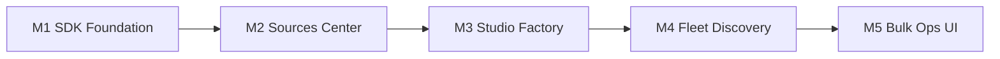
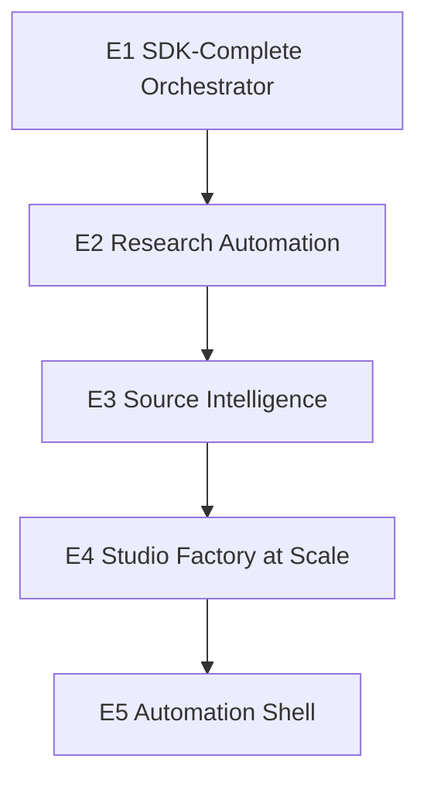

# NOTEtoolsLM — NotebookLM API Power Plan (Research + 5×5)

**Date:** 2026-06-12  
**Focus:** Maximize unofficial NotebookLM API usage — **bulk sources** + **studio media**  
**Out of scope:** Portfolio bridge (E2), team workspaces (E3), multi-provider (E4), open platform (E5)

---

## Executive summary

Google does **not** ship a public consumer API for notebooklm.google.com. Power users rely on **reverse-engineered** clients. NOTEtoolsLM already depends on [`notebooklm-sdk`](https://github.com/agmmnn/notebooklm-sdk) (TypeScript port of [`notebooklm-py`](https://github.com/teng-lin/notebooklm-py)) but uses **~15% of its surface area** — mostly `notebooks.list` and broken artifact create/list calls.

The biggest wins are:

1. **Fix SDK integration** (correct method signatures, `NotebookLMClient.connect()`, per-notebook iteration)
2. **Ship a Sources Command Center** (bulk URL/file/text/Drive, `waitForSources`, delete, refresh, fulltext export)
3. **Ship a Studio Media Factory** (all artifact types, `waitUntilReady`, typed downloads, fleet-wide batch queue)

---

## API landscape (three tiers)

| Tier | Auth | Best for NOTEtoolsLM? | Bulk sources | Studio media |
|------|------|----------------------|--------------|--------------|
| **A. Unofficial RPC** (`notebooklm-sdk`, `notebooklm-py`, `notebooklm-kit`) | Google session / `npx notebooklm-sdk login` | **Yes — primary** | `addUrl`, `addFile`, `addDrive`, `waitForSources`, `research.importSources` | Full studio: audio, video, slides, quiz, flashcards, infographic, data table, mind map |
| **B. NotebookLM Enterprise** (Google Cloud) | `gcloud auth` + Discovery Engine API | Optional later (org tier) | Official `sources:batchCreate`, `batchDelete`, `uploadFile` | Separate audio overview API; **Podcast API deprecated** (no new customers) |
| **C. UI / extension assist** | Browser DOM | Fallback + gap-fill | Bulk paste URLs (native UI since Aug 2025); extensions below | Scrape studio cards when SDK list misses items |

**Recommendation:** Stay on **Tier A** for v2.9–v3.2. Add Tier B only if you onboard Enterprise customers. Keep Tier C (Playwright scrape) as discovery fallback.

---

## Open-source & community tools (adopt / learn from)

### Core SDKs (use directly)

| Project | Lang | Stars* | Why it matters |
|---------|------|--------|----------------|
| [agmmnn/notebooklm-sdk](https://github.com/agmmnn/notebooklm-sdk) | TS | npm 0.1.8 | **NOTEtoolsLM dependency** — full [DOCS.md](https://github.com/agmmnn/notebooklm-sdk/blob/master/DOCS.md): sources, artifacts, chat, research, notes, sharing |
| [teng-lin/notebooklm-py](https://github.com/teng-lin/notebooklm-py) | Python | ~trending | Richest feature set: **batch downloads**, source labels, MCP server, REST server, multi-account, `--prompt-file`, cinematic video |
| [photon-hq/notebooklm-kit](https://github.com/photon-hq/notebooklm-kit) | TS | ~37 | Alternative TS SDK — watch for API drift fixes |
| [agmmnn/n8n-nodes-notebooklm-sdk](https://github.com/agmmnn/n8n-nodes-notebooklm-sdk) | n8n | — | Workflow automation pattern for scheduled source ingest + generate |

\*Stars change; treat as ecosystem signal not selection criteria.

### Bulk source helpers

| Project | Role |
|---------|------|
| [eluchansky10/notebooklm-web-importer](https://github.com/eluchansky10/notebooklm-web-importer) | Chrome extension — bulk URL import patterns |
| [NotebookLM Web Importer](https://chromewebstore.google.com/detail/notebooklm-web-importer/ijdefdijdmghafocfmmdojfghnpelnfn) | CWS extension — reference UX for paste-many-URLs |
| [crazynomad/notebooklm-jetpack](https://github.com/crazynomad/notebooklm-jetpack) | Power-user extension enhancements |
| XDA: [bulk URL in native UI](https://www.xda-developers.com/notebooklm-bulk-url-feature/) (Aug 2025) | Google added multi-URL paste — **automate via SDK loop**, don’t rebuild DOM hacks for URLs |

### Automation / scraping bridges

| Project | Role |
|---------|------|
| [Apify: clearpath/notebooklm-api](https://apify.com/clearpath/notebooklm-api) | Hosted actor — pattern for rate limits & queue |
| [Apify: flamboyant_leaf/apify-to-notebooklm](https://apify.com/flamboyant_leaf/apify-to-notebooklm) | Push external datasets → notebooks |
| [n8n: Reddit scrape → NotebookLM](https://n8n.io/workflows/8140-automate-content-research-with-reddit-scraping-ai-analysis-and-google-sheets/) | Recipe: external research → sources |

### Official Google (Enterprise only)

- [Sources batchCreate / batchDelete / uploadFile](https://docs.cloud.google.com/gemini/enterprise/notebooklm-enterprise/docs/api-notebooks-sources) — true batch REST, GCP auth
- [Podcast API](https://docs.cloud.google.com/gemini/enterprise/notebooklm-enterprise/docs/podcast-api) — **deprecated**, not allowlisting new customers

---

## What NOTEtoolsLM uses today vs full SDK

### Implemented (partial)

| Area | NOTEtoolsLM | Gap |
|------|-------------|-----|
| Notebooks | `GET /api/fleet`, discovery sync | No create/rename/delete/share |
| Artifacts | `/api/generate`, discovery scan, vault store | **Wrong create signatures**; no `waitUntilReady`; scan calls `artifacts.list()` **without notebookId** |
| Discovery | SDK scan + Playwright scrape | Scrape fallback good; SDK scan incomplete |
| Downloads | Vault store, bulk-download metadata | Not using `downloadAudio/Video/SlideDeck/...` per type |

### Not implemented (high value)

| SDK module | Capabilities to add |
|------------|---------------------|
| **sources** | `list`, `addUrl`, `addText`, `addFile`, `addFileBuffer`, `addDrive`, `waitForSources`, `delete`, `rename`, `checkFreshness`, `refresh`, `getFulltext`, `getGuide` |
| **artifacts** | `createQuiz`, `createFlashcards`, `createInfographic`, `createDataTable`, `suggestReports`, `pollUntilReady`, `reviseSlide`, `exportReport` to Drive |
| **research** | `start` → `poll` → `importSources` (automated source packs) |
| **chat** | Fleet Q&A, source-grounded queries from dashboard |
| **notes** | `listMindMaps`, sync mind maps to vault |

### Known bugs to fix first

```js
// sdk-wrapper.js — WRONG (current)
a.createAudio?.call(a, { notebookId, prompt, title });

// notebooklm-sdk DOCS — CORRECT
await client.artifacts.createAudio(notebookId, { format: AudioFormat.DEEP_DIVE, ... });
await client.artifacts.waitUntilReady(notebookId, artifactId);
const mp3 = await client.artifacts.downloadAudio(notebookId, artifactId);
```

```js
// server.js discovery — WRONG (current)
const generic = await client.artifacts?.list?.() || [];

// CORRECT — per notebook
for (const nb of notebooks) {
  const arts = await client.artifacts.list(nb.id);
}
```

---

## Part A — 5 Milestones (execution)

Target: **v2.9.0 → v3.3.0** — API power track only.



### M1 — SDK Foundation Repair · v2.9.0

**Outcome:** Every SDK call uses documented signatures; capability matrix reflects reality.

| Task | Detail |
|------|--------|
| Upgrade | Pin `notebooklm-sdk@^0.1.8`; migrate to `NotebookLMClient.connect()` |
| Fix wrapper | `lib/sdk-wrapper.js` — artifact create/download/wait with `(notebookId, ...)` arity |
| Fix discovery | Iterate notebooks for `artifacts.list*` and `sources.list` |
| Capabilities | Expand `getCapabilities()` for all source + artifact methods |
| Tests | `tests/sdk-wrapper.test.js` — mock client shape parity with DOCS.md |

**Done when:** One real audio job completes: create → waitUntilReady → downloadAudio → vault.

---

### M2 — Sources Command Center · v3.0.0

**Outcome:** Bulk manage sources across the fleet without opening NotebookLM tabs.

| API routes | SDK mapping |
|------------|-------------|
| `GET /api/notebooks/:id/sources` | `sources.list` |
| `POST /api/sources/bulk-add` | Loop `addUrl` / `addText` / `addFileBuffer`; `waitForSources` |
| `POST /api/sources/bulk-delete` | Parallel `sources.delete` |
| `POST /api/sources/refresh-stale` | `checkFreshness` → `refresh` |
| `GET /api/sources/:id/fulltext` | `getFulltext` + `getGuide` |
| `POST /api/research/run` | `research.start` → poll → `importSources` |

| UI | |
|----|---|
| Dashboard | Sources tab per notebook: table + multi-select delete |
| Extension | Paste URL list (newline-separated) → bulk-add job |
| Import formats | `.txt` URL list, `.csv` (url, title), folder upload → `addFile` queue |

**Done when:** 50 URLs added to one notebook with progress bar; fulltext export for 5 sources.

**Borrow from:** `notebooklm-py` CLI `source add-research`, web-importer paste UX.

---

### M3 — Studio Media Factory · v3.1.0

**Outcome:** Full studio artifact types with reliable poll + typed download to vault.

| Task | Detail |
|------|--------|
| Artifact types | Add quiz, flashcards, infographic, data table to prefabs + queue |
| Generation | `create*` → `pollUntilReady` / `waitUntilReady` with WebSocket progress |
| Downloads | Route by type: `downloadAudio`, `downloadVideo`, `downloadSlideDeck` (pdf/pptx), `getReportMarkdown`, etc. |
| Batch studio | `POST /api/studio/batch-generate` — queue N artifacts across M notebooks |
| Suggest | `suggestReports` before custom report prefabs |

**Done when:** Batch job generates 3 audio + 2 slide decks across 2 notebooks; all land in vault with correct MIME paths.

**Borrow from:** `notebooklm-sdk/examples/download.ts`, `notebooklm-py` batch download docs.

---

### M4 — Fleet-Wide Discovery v2 · v3.2.0

**Outcome:** Accurate inventory of sources + studio media across all notebooks.

| Task | Detail |
|------|--------|
| Source sync | `GET /api/discovery/sources` — all notebooks, counts, processing status |
| Media sync | Per-notebook `listAudio`, `listVideo`, `listSlideDecks`, `listQuizzes`, … |
| Freshness report | Notebooks with stale URL sources flagged |
| CDI per source | Extend `lib/cdi.js` with source-level citation density from `getFulltext` |
| De-dupe | Keep `artifact-catalog.js` fingerprints; add `source-catalog.js` |

**Done when:** Discovery sync returns source count matching NotebookLM UI for 3 test notebooks.

---

### M5 — Bulk Operations UX · v3.3.0

**Outcome:** Power-user workflows for sources + studio without leaving NOTEtoolsLM.

| Workflow | Description |
|----------|-------------|
| **Source pack import** | CSV/JSON manifest → create notebook → bulk sources → wait → optional auto-generate audio |
| **Studio sweep** | Select 10 notebooks → generate executive briefing on each → download all reports |
| **Stale source janitor** | Fleet-wide refresh or delete failed/stuck sources |
| **Extension toolbar** | “Add these tabs as sources”, “Generate podcast from this notebook” |
| **Job dashboard** | Kanban shows source jobs vs studio jobs separately |

**Done when:** Documented “50-source research pack” recipe works end-to-end from dashboard.

---

## Milestone summary

| # | Theme | Version | Primary SDK modules |
|---|-------|---------|---------------------|
| M1 | SDK foundation repair | v2.9.0 | client, artifacts (fix) |
| M2 | Sources command center | v3.0.0 | sources, research |
| M3 | Studio media factory | v3.1.0 | artifacts (full) |
| M4 | Fleet discovery v2 | v3.2.0 | notebooks, sources, artifacts |
| M5 | Bulk ops UX | v3.3.0 | all + queue + UI |

**Verify each milestone:** `npm run ci` + manual SDK auth + one bulk source run + one studio batch.

---

## Part B — 5 Evolution (NotebookLM depth only)

Horizon: stay inside **NotebookLM power-user** domain — no portfolio, teams, or multi-provider.



### E1 — SDK-Complete Orchestrator *(M1–M2)*

Use 100% of `notebooklm-sdk` modules. NOTEtoolsLM becomes the reference Node implementation for agmmnn's SDK.

### E2 — Research Automation *(M2 + research API)*

Pipelines: keyword → `research.start` → import top N sources → auto-generate briefing + podcast. Scheduled nightly sync jobs.

### E3 — Source Intelligence *(M4)*

Source guides, fulltext search across vault, freshness dashboards, per-source CDI, label/tag system (port patterns from `notebooklm-py` source labels).

### E4 — Studio Factory at Scale *(M3 + M5)*

Fleet-wide media generation templates: “every notebook gets a Monday podcast”, quota/rate-limit aware queue, slide revision loop (`reviseSlide`).

### E5 — Automation Shell *(optional)*

CLI (`notetoolslm` npm bin), n8n community node fork, cron-friendly `npm run sync:fleet` — **not** an open plugin marketplace.

---

## What we explicitly skip (per your direction)

| Previous item | Status |
|---------------|--------|
| Portfolio push to lookBOOK/cineforge | Skip |
| Team workspaces / RBAC | Skip |
| Multi-provider (Perplexity, Gemini, local RAG) | Skip |
| Open research platform / MCP marketplace | Skip |
| Chrome Web Store launch as primary milestone | Defer — can run parallel but not blocking API work |

---

## Optional: notebooklm-py sidecar

If TS SDK lags `notebooklm-py` on new Google RPC changes:

- Spawn `notebooklm` CLI or REST server as subprocess for **batch download** and **source labels** only
- Keep Node as orchestrator; Python as capability adapter
- Only introduce if M3 hits SDK gaps — avoid dual-runtime until necessary

---

## Suggested immediate next step

**M1 SDK Foundation Repair** — fix create/download/wait signatures and per-notebook discovery. Everything else (bulk sources, studio batch) depends on this.

Estimated effort: M1 ~2 days, M2 ~3 days, M3 ~4 days, M4 ~2 days, M5 ~3 days.